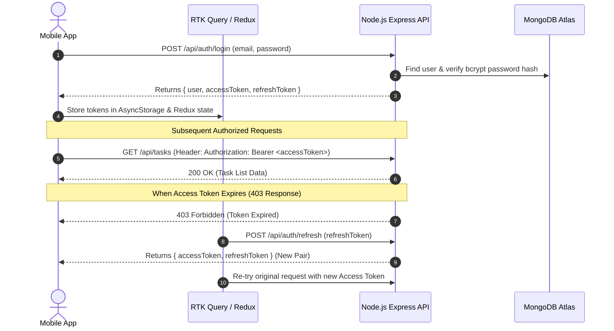

# 📑 Taskly — Editorial To-Do Companion

A modern, Substack-inspired full-stack task management application crafted with **React Native**, **Node.js**, **TypeScript**, **Express**, and **MongoDB Atlas**. Built with warm editorial aesthetics, zero-delay optimistic UI updates, and secure JWT-based authentication.

---

## 🎨 Design Philosophy & Aesthetics

Taskly breaks away from typical corporate task apps by adopting a warm, Substack-inspired editorial aesthetic:
- **Palette**: Warm Cream (`#F4EAE1`), Dark Burgundy (`#43252B`), Accent Rust (`#C85A32`), and Muted Taupe (`#B29B90`).
- **Typography**: Elegant Serif headers paired with clean Sans-serif body typography.
- **Edge-to-Edge Responsiveness**: Custom dynamic safe-area insets (`react-native-safe-area-context`) ensuring pixel-perfect headers and custom pill-shaped bottom tab navigation across notched and gesture-based screens.

---

## 🛠️ Full Tech Stack

### **Mobile App (Frontend)**
- **Framework**: React Native 0.86 (TypeScript)
- **Navigation**: React Navigation v6 (`@react-navigation/bottom-tabs`, `@react-navigation/native-stack`) with custom pill-style tab bar.
- **State & Data Fetching**: Redux Toolkit & **RTK Query**
  - **Optimistic Updates**: 0ms instant UI feedback for task toggling and deletion with automatic background sync and failure rollback.
  - **Automatic Re-auth Middleware**: Intercepts `403 Forbidden` responses to silently refresh JWT access tokens.
- **UI Components & Date Handling**: `@react-native-community/datetimepicker`, `@react-native-async-storage/async-storage`.

### **Backend API**
- **Runtime & Language**: Node.js + TypeScript (`npx tsx`)
- **Framework**: Express.js REST API with clean modular MVC architecture.
- **Validation & Security**: `express-validator`, `bcryptjs` (salt rounds = 10), CORS.
- **Database**: MongoDB Atlas (Cloud) with **Mongoose ODM**.

### **Infrastructure & Hosting**
- **Database Cloud**: [MongoDB Atlas](https://www.mongodb.com/cloud/atlas) (M0 Cloud Cluster).
- **Backend Cloud**: [Render.com](https://render.com) (24/7 Web Service).
- **Tunneling & Edge Routing**: Cloudflare Edge Tunnels (`cloudflared`).

---

## 🔐 Authentication Architecture (JWT Access & Refresh Tokens)

Taskly implements a robust multi-token JWT authentication flow to ensure high security and seamless user sessions:



### Key Security Features:
1. **Access Token**: Short-lived JWT signed with `JWT_SECRET` sent in the `Authorization: Bearer <token>` HTTP header for protected API routes.
2. **Refresh Token**: Long-lived JWT signed with `JWT_REFRESH_SECRET` stored in device `AsyncStorage` to silently acquire new access tokens without prompting re-login.
3. **Password Security**: Passwords are hashed using `bcryptjs` before storage in MongoDB.
4. **Session Isolation**: Dispatches `baseApi.util.resetApiState()` on logout or account switch, purging cached query data from memory to prevent cross-account data leaks.

---

## ⚡ Core Features

- ⏱️ **Instant (0ms) Task Toggling**: Checkbox state flips immediately on touch via RTK Query optimistic updates while network requests run in the background.
- 🚫 **Past Date Validation**: Prevents scheduling tasks or setting deadlines in the past with inline error indicators.
- ⚡ **Smart Sorting Algorithm**: Automatically ranks tasks based on overdue state, imminent deadlines, and critical priority levels.
- 🔍 **Real-time Search & Multi-Filtering**: Filter tasks by priority (*Critical, High, Medium, Low*), status (*Pending, Completed*), or search by title/description.
- 📱 **Edge-to-Edge UI Layout**: Tailored top header padding and floating bottom navigation tab bar designed for all screen sizes.

---

## 📦 Project Structure

```text
├── backend/
│   ├── src/
│   │   ├── config/          # MongoDB Mongoose database connection
│   │   ├── controllers/     # Auth and Task controller handlers
│   │   ├── middleware/      # JWT auth guard & express-validator
│   │   ├── models/          # Mongoose schemas (User, Task)
│   │   ├── routes/          # Express REST routes (/auth, /tasks)
│   │   ├── utils/           # JWT sign/verify helper utilities
│   │   └── index.ts         # Express server entry point
│   ├── package.json
│   └── tsconfig.json
│
└── mobile/
    ├── src/
    │   ├── api/             # RTK Query base API & endpoints
    │   ├── components/      # TaskCard & reusable UI components
    │   ├── navigation/      # Root & App navigators with CustomTabBar
    │   ├── screens/         # Home, TaskDetail, AddTask, Profile, Login, Register
    │   ├── store/           # Redux store & auth/tasks slices
    │   └── theme/           # Substack color tokens, typography & spacing
    ├── App.tsx
    └── package.json
```

---

## 🚀 Environment Variables

Create a `.env` file in the `backend/` directory:

```env
PORT=5000
MONGO_URI=mongodb+srv://<username>:<password>@cluster0.mongodb.net/todo-app?retryWrites=true&w=majority
JWT_SECRET=your_jwt_access_secret_key_2026
JWT_REFRESH_SECRET=your_jwt_refresh_secret_key_2026
NODE_ENV=production
```

---

## 📄 License

Distributed under the MIT License. See `LICENSE` for more information.
